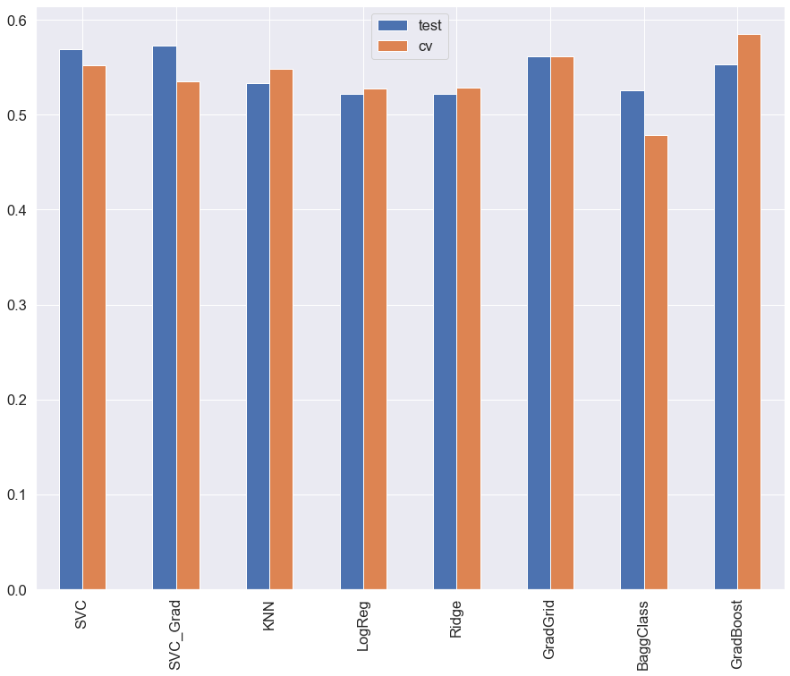

# Results and Thoughts

## Result

While the accuracy over the course of three seasons for my models (ranging from .39 to .48) was lower than the baseline (.48), the test and cv scores were close enough and high enough to make me believe that I'm on the right track. Also, the fact that the bookies never favour a draw makes me think that either I need to follow that direction in future iterations or try to exploit the fact.

## Processes and Thoughts

This was a multi-class classification problem that I approached from two angles. Initially I used in game events up to half time to try and predict the Full Time Result. The baseline for this problem was .61 and my initial models were achieving around .68. This was promising but the lack of available bookmaker data from haltime lead me to abandon this route for now.

I then created any information I thought would be relevant from before the game started in order to try and predict either a win (0), loss (1) or a draw (2). 

- I used the xG average for the home team across the last 5 home games in order to get a relative idea of form regardless of the final result.
- Per Home Team I used the xG average of the away team across the five games.
- I used the ELO difference between the Home Team and the Away team in order to get an idea of the quality divide of the game.
- I used the results from the last five home games to get a further idea of form.
- I split the time of the season into thirds with the reasoning being that a team may (over/under)perform depending when in the season they're playing.

I applied these features to the following models: 

- Standard Logistic Regression Model
- Logistic Regression model with Ridge Penalty applied
- Support Vector Machine
- Bagging Classifier using standard Decision Tree
- Gradient Boost Classifier Model
- K-Nearest Neighbours Classifier Model

## What Next:

- Form against specific opponent (last 3 games)
- Avg possession against specific opponent (when playing at home and away) (last 3 games)
- Home AND Away form (5 games)
- Avg Home AND Away gd (5 games)
- Game number (1 to 38) instead of splitting season into thirds may provide more weight.
- Wage Bill 
- Players in each game with ratings as per Football Manager/Fifa
- Further analysis on predict_proba results compared to bookies
- Interactive Website

